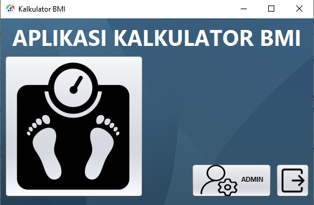
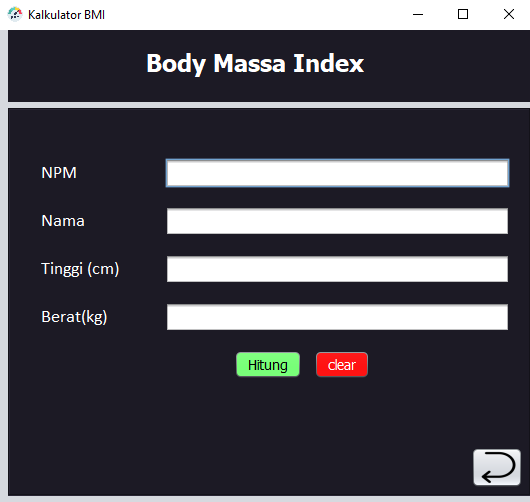
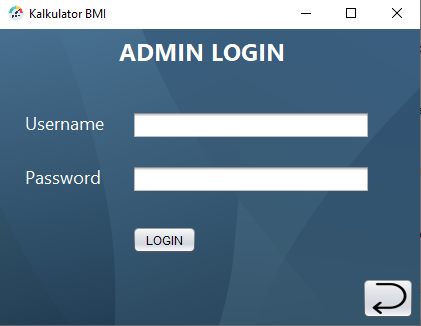
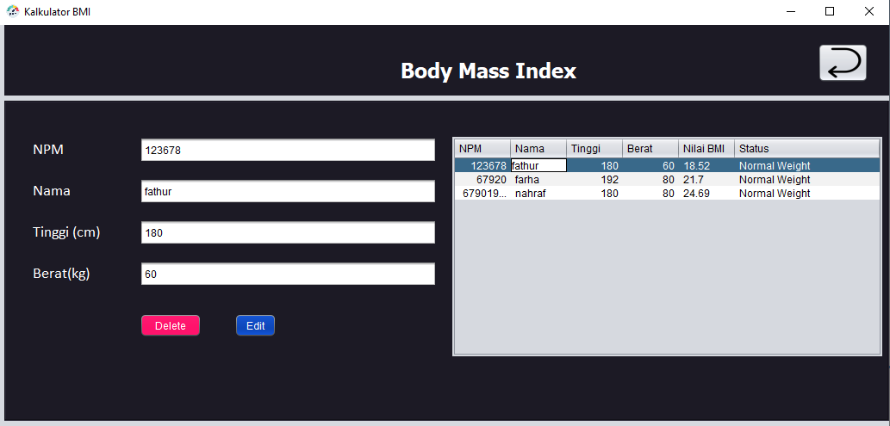

<h1>BMI APPS</h1>

Body Mass Index Application

<h2>DESKRIPSI</h2>

    Aplikasi yang membantu Anda memahami dan mengelola kesehatan tubuh Anda.  
    Dengan memasukkan data tinggi dan berat badan user akan mendapatkan nilai dari Body Mass Index miliknya.  

<h2>FEATURE</h2>
<ul>
    <li>
        Local Database
    </li>
    <li>
        Authentication
    </li>
    <li>
        Admin Section
    </li>
    <li>
        User Section
    </li>
</ul>

<h2>DEMO</h2>

<table>
  <tr>
    <td>HomePage</td>
     <td>UserSection</td>
  </tr>
  <tr>
    <td></td>
    <td></td>    
  </tr>
</table>

<table>
    <tr>
        <td>Aunthentication Page</td>
        <td>AdminSection Page</td>
    </tr>
    <tr>
      <td></td>
      <td></td>
    </tr>
</table>

 
<h2>Copyright @FarhanFathur</h2>